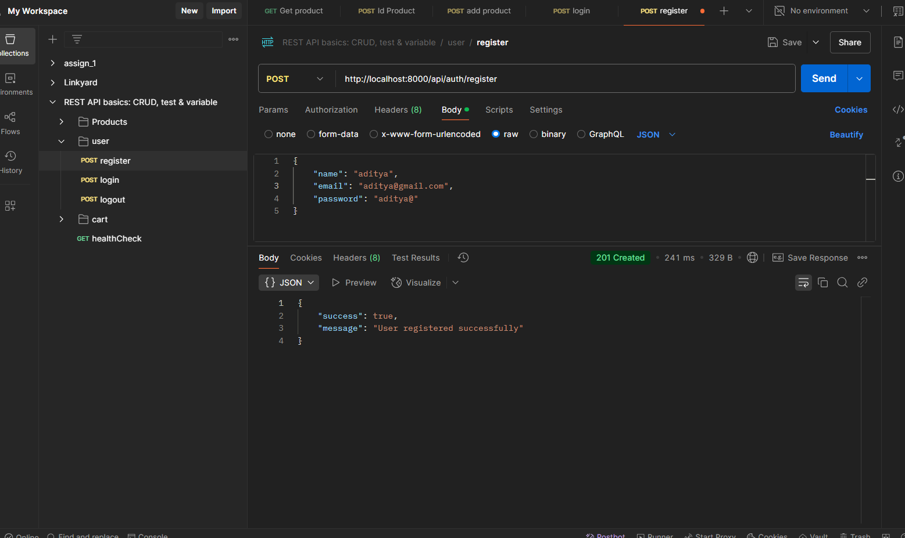

# 🚀 ShoppyGlobe E-commerce Backend (Node.js, Express.js, MongoDB)

## ✅ Project Overview

This is the backend server for the ShoppyGlobe E-commerce Application, built using:

- **Node.js** and **Express.js** for API creation.
- **MongoDB** for database storage.
- **JWT Authentication** for secure access.
- **Error handling** and **validation** for stability.
- **ThunderClient** or **Postman** for API testing.

---

💻 Github: [https://github.com/Aditya-Deshmukh9/shoppyGlobe_React](https://github.com/Aditya-Deshmukh9/shoppyGlobe_React)

## ✅ Installation & Setup

### 1. Clone the Repository:

```bash
git clone <your-repo-url>
cd shoppyglobe-backend
```

### 1. Clone the Repository:

```bash
npm install && npm run dev
```

Or

```bash
pnpm install && pnpm run dev
```

2. create .env file and add with this.

```bash
    PORT=
    MONGODB_URI=
    ACCESS_TOKEN_SECRET=
    ACCESS_TOKEN_EXPIRY=
    REFRESH_TOKEN_SECRET=
    REFRESH_TOKEN_EXPIRY=
```

## ✅ API Routes

### 🔐 Authentication Routes

📌 **Base URL**: `http://localhost:8000/`

---

### 1. **Get All Products**

- **Route**: `GET /api/products`
- **Description**: fetches all products from the db
- **Screenshot**:
  

<br>

### 2. **Get Product by id**

- **Route**: `GET /api/products/:id`
- **Description**:Retrieves a single product by its ID.
- **Screenshot**:
  

<br>

### 3. **Add Product**

- **Route**: `POST /api/products`
- **Description**:Adds a new product to the database.
- **Screenshot**:
  

- **Mongodb Compass**
  
  <br>

### 4. **update Product**

- **Route**: `PUT /api/products/:id`
- **Description**:Updates an existing product by its ID.
- **Screenshot**:
  
- **Mongodb Compass**
  

<br>

### 5. **delete Product**

- **Route**: `DELETE /api/products/:id`
- **Description**: Deletes a product by its ID.
- **Screenshot**:
  

<br>

### 6. **User Register**

- **Route**: `POST /api/auth/register`
- **Description**:Creates a new user account.
- **Screenshot**:
  
- **Mongodb Compass**
  

<br>

### 7. **User login**

- **Route**: `POST /api/auth/login`
- **Description**:Authenticates the user and generates JWT tokens.
- **Screenshot**:
  
- **Mongodb Compass**
  

<br>

### 8. **User logout**

- **Route**: `POST /api/auth/logout`
- **Description**:Logout the user out by invalidating the refresh token.
- **Screenshot**:
  

<br>

### 9. **ADD to Cart**

- **Route**: `POST /api/cart`
- **Description**: Adds a product to the user's cart.
- **Screenshot**:
  
- **Mongodb Compass**
  

<br>

### 10. **get Cart Item**

- **Route**: `GET /api/cart`
- **Description**:Retrieves all cart item for the logged-in user.
- **Screenshot**:
  

<br>

### 11. **update Cart Item**

- **Route**: `PUT /api/cart`
- **Description**:Updates the quantity or details of a cart item.
- **Screenshot**:
  
- **Mongodb Compass**
  

<br>

### 12. **delete Cart Item**

- **Route**: `PUT /api/cart`
- **Description**: Removes a specific item from the user's cart.
- **Screenshot**:
  
- **Mongodb Compass**
  

<br>
